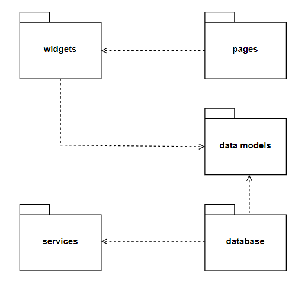
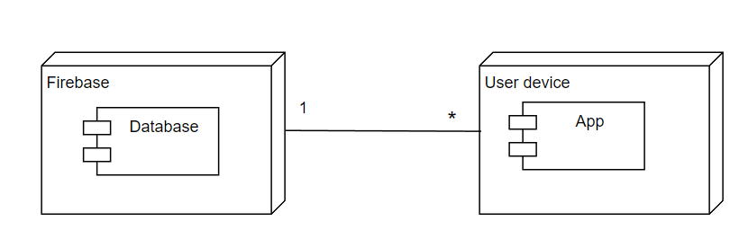

## Architecture and Design
In this file we will describe the architecture and the design behind our app.

### Logical architecture
Our app's structure was planned with the goal of being easy to understand just by looking at the code, but at the same time to ease future work and upgrades on it. It is divided in the following packages:

- `pages` - this package contains all the source code for the pages that will be displayed to the user
- `widgets` - this package contains all the widgets that the app uses to show information to the user
- `data models` - structures used to organize the information in the database
- `database` - designed to store the infromation retreived from the Firebase cloud
- `services` - all the interface need to interact with the Firebase cloud

    

    Fig. 1 - Logical Architecture UML

### Physical architecture
In our app, there are only 2 entities envolved:

- `Firebase server` - where the data adquired from the API is stored
- `User device` - where the app will run and used

    

    Fig. 2 - Physical Architecture UML

### Vertical prototype
In our vertical prototype, we implemented multiple pages (Home Page, Favorites Page and Help Page), to give a basic idea of what we want to create. Also, we added a simple button widget, just to show some "state" functionality, a key feature that we will need in the app.

The vertical prototype is available in the "app" directory, on the repository root.

