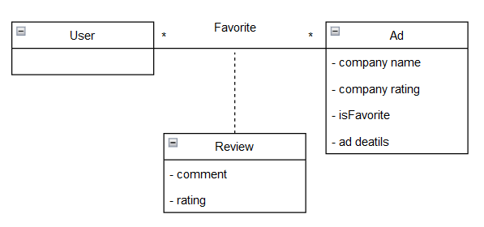

# Requirements

## User stories
### Story nº 1
As a user, I want to search for a specific job offer, without having to scroll through all the ads, so that I can find the job I want faster.

### User interface mockup


### Acceptance tests
```Gherkin
Scenario: Search for Java Developer jobs.
  Given The search screen
  When I tap the search bar
  And I insert "Java Developer"
  And I tap the search button,
  Then the results of the search for "Java Developer" appear
```

### Value and effort estimation
- Value: Must-have
- Effort: 8

---

### Story nº 2
As a user, I want to see the reviews and/or opinions on a certain job offer, so that I can have a better idea of what the job is like.

### User interface mockup


### Acceptance tests
```Gherkin
Scenario: See the reviews about a job offer.
  Given The post of a job offer
  When I tap "Reviews",
  Then the reviews about the job offer appear
```

### Value and effort estimation
- Value: Should-have
- Effort: 8

---

### Story nº 3
As a user, I want to be able to filter job offers by different criteria, not only to make my search easier and also to find the job I want faster, but also to compare different job offers.

### User interface mockup


### Acceptance tests
```Gherkin
Scenario: Filter the search.
  Given The search screen
  When I tap the filters button
  And I select the criteria I want to filter by
  And I tap "Search",
  Then the results of the search for appear filtered by the criteria I selected
```

### Value and effort estimation
- Value: Must-have
- Effort: 13

---

### Story nº 4
As a user, I want to have easy and interactive access to job offers in different locations, so that I can find a job in a place that I prefer.

### User interface mockup


### Acceptance tests
```Gherkin
Scenario: See the job offers in Porto.
  Given The main screen
  When I tap "Porto",
  Then the job offers in Porto district appear
```

### Value and effort estimation
- Value: Must-have
- Effort: 8

---

### Story nº 5
As a user, I want to be able to mark a job offer as favorite, so that I can easily find it later.

### User interface mockup


### Acceptance tests
```Gherkin
Scenario: Mark a job offer as favorite.
  Given The post of a job offer
  When I tap the favorite button,
  Then the job offer is marked as favorite
```

### Value and effort estimation
- Value: Should-have
- Effort: 5

---

### Story nº 6
As a user, I want to be able to see the job offers that I have marked as favorite, so that I can easily find them later.

### User interface mockup


### Acceptance tests
```Gherkin
Scenario: See the job offers that I have marked as favorite.
  Given The navigation drawer
  When I tap "Favorites",
  Then the job offers that I have marked as favorite appear
```

### Value and effort estimation
- Value: Must-have
- Effort: 5

---

### Story nº 7
As a user, I want to be able to rate and review a job offer, so that I can give my opinion on the job.
### User interface mockup


### Acceptance tests
```Gherkin
Scenario: Rate a job offer.
  Given The job offer post
  When I tap "See more"
  And I tap the star
  And I select the rate
  And I tap the send button,
  Then my review appears
```

### Value and effort estimation
- Value: Should-have
- Effort: 8

---

### Story nº 8
As a user, I want to see detailed information about a job offer, so that I can have a better idea of what the job is like.

### User interface mockup


### Acceptance tests
```Gherkin
Scenario: See the details of a job offer.
  Given The search screen
  When I tap a job offer,
  Then the details of the job offer appear
```

### Value and effort estimation
- Value: Must-have
- Effort: 5

---

### Story nº 9
As a user, I want to be able to navigate easily through the app pages.

### User interface mockup


### Acceptance tests
```Gherkin
Scenario: Switch pages.
  Given any page
  When I tap the top left corner button
  And the navigation drawer opens,
  Then I can select which page to navigate to
```

### Value and effort estimation
- Value: Must-have
- Effort: 5

---

### Story nº 10
As a user, I want to see the reviews and/or opinions on a certain job offer, so that I can have a better idea of what the job is like.

### User interface mockup


### Acceptance tests
```Gherkin
Scenario: See reviews of a job post.
  Given The job offer post
  When I tap "See more"
  Then the job offer's reviews appears
```

### Value and effort estimation
- Value: Must-have
- Effort: 5

---

<br>

## Domain Model
 <p align="center" justify="center">
  
</p>
<p align="center" justify="center">
  <b>Figure 1:</b> Domain model of the FilterIT application
</p>
<br>
The domain model of the FilterIT application is shown in Figure 1. The domain model is composed of the following entities:

- **User**: A user is a person that uses the application. A user can not only be a newly formed IT worker, but also a senior worker looking for a new workplace. 
- **Ad**: An ad is a job offer. It contains information about job, like the company, the job position, the salary, the location, requirements for the job and others.
- **Review**: A review is a feedback from a user about a job offer. It contains ia rating and an optional text review.
- **Favorite**: A favorite is a job offer that a user has marked as favorite. A user can have multiple favorites.
