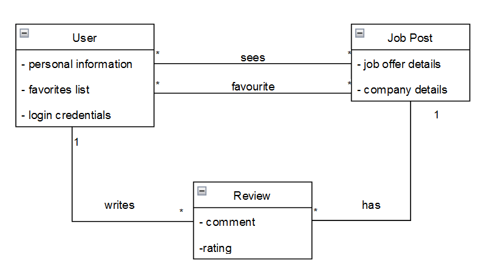

# Requirements

## User stories
### Story nº 1
As a user, I want to search for a specific job offer, without having to scroll through all the ads, so that I can find the job I want faster.

### User interface mockup

### Acceptance test

### Value and effort estimation
- Value: Must-have
- Effort: 5

---

### Story nº 2
As a user, I want to see the reviews and/or opinions on a certain job offer, so that I can have a better idea of what the job is like.

### User interface mockup

### Acceptance test

### Value and effort estimation
- Value: Should-have
- Effort: 8

---

### Story nº 3
As a user, I want to be able to filter the job offers by different criteria, not only to that my search is easier and also to find the job I want faster, but also to compare the different job offers.

### User interface mockup

### Acceptance test

### Value and effort estimation
Value: Must-have
Effort: 8

---

### Story nº 4
As a user, I want to have easy and interactive access to job offers in different locations, so that I can find a job in a place that I prefer.

### User interface mockup

### Acceptance test

### Value and effort estimation
Value: Must-have
Effort: 8

---

### Story nº 5
As a user, I want to be able to mark a job offer as favorite, so that I can easily find it later.

### User interface mockup

### Acceptance test

### Value and effort estimation
Value: Should-have
Effort: 5

---

### Story nº 6
As a user, I want to be able to see the job offers that I have marked as favorite, so that I can easily find them later.

### User interface mockup

### Acceptance test

### Value and effort estimation
Value: Must-have
Effort: 5

---

### Story nº 7
As a user, I want to be able to rate and review a job offer, so that I can give my opinion on the job.
### User interface mockup

### Acceptance test

### Value and effort estimation
- Value: Should-have
- Effort: 8

---

### Story nº 8
As a user, I want to see detailed information about a job offer, so that I can have a better idea of what the job is like.

### User interface mockup

### Acceptance test

### Value and effort estimation
Value: Must-have
Effort: 5

---
 

## Domain Model
 

  

  <b>Figure 1:</b> Domain model of the FilterIT application

 
The domain model of the FilterIT application is shown in Figure 1. The domain model is composed of the following entities:

- **User**: A user is a person that uses the application. A user can not only be a newly formed IT worker, but also a senior worker looking for a new workplace. 
- **Ad**: An ad is a job offer. It contains information about job, like the company, the job position, the salary, the location, requirements for the job and others.
- **Review**: A review is a feedback from a user about a job offer. It contains ia rating and an optional text review.
- **Favorite**: A favorite is a job offer that a user has marked as favorite. A user can have multiple favorites.